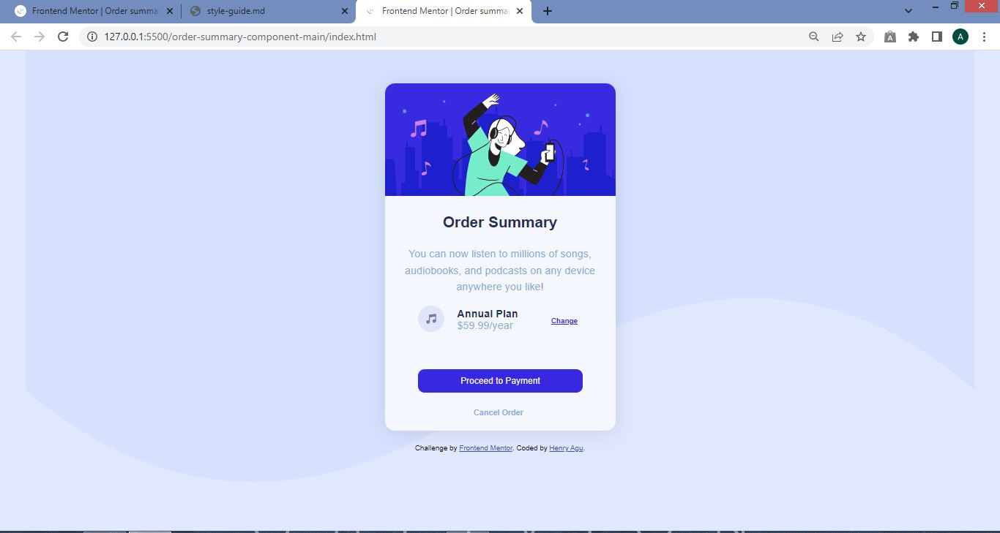

# Frontend Mentor - Order summary card solution

This is a solution to the [Order summary card challenge on Frontend Mentor](https://www.frontendmentor.io/challenges/order-summary-component-QlPmajDUj). Frontend Mentor challenges help you improve your coding skills by building realistic projects. 

## Table of contents

  - [The challenge](#the-challenge)
  - [Screenshot](#screenshot)
  - [Links](#links)
  - [Built with](#built-with)
  - [What I learned](#what-i-learned)
- [Author](#author)

### The challenge

Users should be able to:

- See hover states for interactive elements

### Screenshot

### Links

- Solution URL: (https://github.com/HenryAgu/orderSummary.git)
- Live Site URL: [Add live site URL here](https://your-live-site-url.com)

### Built with

- Semantic HTML5 markup
- CSS custom properties
- Media Query
- Flexbox properties

### What I learned

I understood the use of Media Query and how it manipulates the sites at various sizes.

### Continued development

The accesibility of my webpages.

## Author

- Frontend Mentor - [@HenryAgu](https://www.frontendmentor.io/profile/HenryAgu)
- Twitter - [@_henryi](https://www.twitter.com/_henryi)

